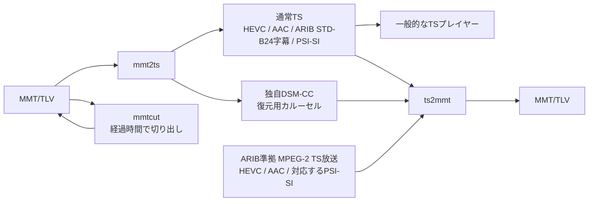

# mmt2ts

by Till0196

MMT/TLVとMPEG-2 TSを相互変換するコマンドラインツールです。映像・音声は
再エンコードせず、MMT/TLVからTSへの変換では字幕とPSI/SIもTS形式へ変換します。

## このツールの位置づけ

放送ストリームの構造調査、変換処理の検証、メディアシステム間の相互運用試験を目的とする
開発・検証用ツールです。

## 対応する規格

MMT (MPEG Media Transport) は、ISO/IEC 23008-1で規定されたメディアトランスポート方式です。
日本の4K/8K放送におけるMMTの運用は、
[ARIB STD-B60](https://www.arib.or.jp/kikaku/kikaku_hoso/std-b60.html)に規定されています。
本ツールはMMTの基本構造に加え、この運用で用いられるsignalling、字幕、番組情報などを扱います。

変換先は、[ARIB STD-B10](https://www.arib.or.jp/kikaku/kikaku_hoso/std-b10.html)に
規定されたPSI/SIを備えるMPEG-2 TSです。MMT側のARIB-TTML字幕・文字スーパーは
[ARIB STD-B24](https://www.arib.or.jp/kikaku/kikaku_hoso/std-b24.html)形式の字幕PESへ、
番組名や番組説明などのSI文字列は同規格の8単位符号へ変換します。

## 変換の概要



`mmt2ts`は映像、音声、字幕、PSI/SIを通常のTSとして出力します。TSへ直接写像できない
MMT signalling、データ放送資源、assetとMPUの対応は、独自のDSM-CC復元用カルーセルへ
保存します。カルーセルは別PIDで伝送されるため、非対応プレイヤーは無視できます。

`ts2mmt`は独自のDSM-CC復元用カルーセルと通常ESからMMT/TLVを再構成します。カルーセルのない
ARIB準拠の放送TSでは、HEVC映像、AAC音声、対応するPSI/SIから新しいMMT/TLVを構成します。
カルーセルから復元したストリームは変換前とバイト単位では一致しませんが、
映像・音声、再生時刻、番組情報、データ放送資源の内容を引き継ぎます。

## インストール

Go 1.26以降が必要です。

```sh
go install ./cmd/mmt2ts
go install ./cmd/mmtcut
go install ./cmd/ts2mmt
```

## 使い方

- `mmt2ts`: MMT/TLVの変換、解析、出力検証
- `ts2mmt`: MPEG-2 TSからMMT/TLVへの変換
- `mmtcut`: MMT/TLVの時間範囲による切り出し

```sh
mmt2ts -i input.mmts -o output.ts
mmt2ts inspect -i input.mmts
mmt2ts verify -i output.ts

ts2mmt -i input.ts -o output.mmts

mmtcut -i input.mmts -o clip.mmts -from 4:30 -to 5:15
mmtcut -i input.mmts -o clip.mmts -from 4:30 -margin 20
```

復元用カルーセルは既定で有効です。`mmt2ts -no-carousel`で無効にできます。

`mmtcut`の`-from`と`-to`は、入力で最初に得られるNTPサンプルを0秒とした経過時間です。
入力ファイルを二分探索するため標準入力は利用できません。切り出し直後に周期送出データを
揃えるには、数十秒程度の`-margin`を指定してください。

各コマンドの全オプションは`-h`で確認できます。

## 出力サンプル

以下はMMT/TLV形式のストリーム(HEVC 1本、AAC 1本、字幕1本、データ放送8本)を40秒切り出した入力に対する
実際の出力です。

```sh
$ mmtcut -i input.mmts -o clip.mmts -from 0:20 -to 1:00
mmtcut: byte range [93899733, 281387797) = 178.8 MiB
```

### 変換レポート

`mmt2ts`は変換内容を標準エラー出力へ報告します(TS本体は標準出力またはファイル)。
入力の統計、生成したSI、記述子ごとの変換可否、ESごとのAU数と損失、TSへ写像できず
保存カルーセルへ回した資源を、変換のたびに確認できます。`-quiet`で抑制できます。

<details>
<summary><code>mmt2ts -i clip.mmts -o clip.ts</code></summary>

```
input: 187488064 bytes, 148489 TLV packets (29883 null, 0 resync, 0 truncated)
  IP: v4=0 v6=1210 compressed-v4=0 compressed-v6=117388 control=8 non-UDP=0 malformed=0 fragments=0 reassembled=0 fragment-errors=0
MMTP: 117388 packets, NTP 1210, parse errors 0, unrouted 307, FEC repair 0, other payload 0
asset dependency decode order: [0/00000000/f100 0/00000000/f110 0/00000000/f130 0/00000000/f140 …], issues: []
signaling on packet ids the PLT did not announce: 559
signaling: 1821 messages, 800 tables, malformed 0, dropped fragments 1, unknown map[]
MPU: payloads 115131, data units 11585, sequence gaps 0 (0 packets), out of order 0, fragment errors 2
  metadata fragments 0, non-timed units 15119, parse errors 0, scrambled packets 0
  transport MFU header non-zero: movie fragments 0, sample numbers 0, offsets 0, priorities 0, dependencies 0

MMT-SI: 1021 messages, 949 sections (8 short), CRC errors 0, truncated 0
  complete tables 31, incomplete versions 5, next-version sections 0, duplicate mismatches 0
  current tables: TLV-NIT 1, MH-SDT 11, MH-EIT sections 34, MH-BIT 1, MH-CDT 0, MH-AIT 1
  received table ids: 0x40=4 0x82=399 0x8b=80 0x8c=128 0x8d=127 0x94=38 0x95=17 0x9c=80 …
  tables with no decoder: map[130:6 254:1], messages with no decoder: map[]

generated SI:
  NIT          PID 0010  1 sections, sent 4 times
  SDT          PID 0011  1 sections, sent 20 times
  TOT          PID 0014  1 sections, sent 8 times
  BIT          PID 0024  1 sections, sent 4 times
  EIT p/f      PID 0012  2 sections, sent 40 times
  EIT schedule PID 0012  32 sections, sent 128 times

SI descriptors:
  MH  0x008010 converted 1034, unsupported 4, invalid 0 (component tag 0x0000 is not in the output)
  MH  0x008012 converted 1031, unsupported 0, invalid 0
  MH  0x008014 converted 1038, unsupported 35, invalid 0 (component tag 0x0011 is not in the output)
  MH  0x008017 converted 0, unsupported 120, invalid 0 (SI parameter names MMT table 0xfe, which has no transport stream table)
  MH  0x008038 converted 1482, unsupported 0, invalid 0
  MH  0x008039 converted 0, unsupported 1482, invalid 0 (no transport stream descriptor preserves remote viewing and retention control)
  …
  TLV 0x000040 converted 8, unsupported 0, invalid 0
  TLV 0x0000cd converted 0, unsupported 8, invalid 0 (no transport stream network descriptor carries remote control key assignments)
  …

SI text: 4844 strings, 76355 characters, standard 76291, normalized 0, substituted 64, DRCS 0, unconvertible 0
  shortened to fit a descriptor: 136 strings, 6547 characters removed

service_id: 0x00b5, MPT updates: 400, PMT versions: 4
output: 805693 TS packets (151470284 bytes), PAT 424, PMT 424, PCR-only 18, null 0
output timeline: 40.098 s
preservation carousel: realtime PID 0x1d00 (10 modules), object PID 0x1d01 (3 modules), 14375080 bytes
  segments 81, records 18468, AV map entries 113, codec configs 3, losses 0
  time window 500 ms (profile default), windows sent once 80
  objects 2 (1219 bytes), commits 3
  sections: realtime DII 167 / DDB 3704, object DII 80 / DDB 99

elementary streams:
 service   PID  type  stream  mmt_tag ts_tag lang    AUs in     out       losses no-timing wait-IRAP  gaps
  0x00b5  1011  hev1  0x0024   0x000000  0x0000  -         2360      2360          2         0         0     0
  0x00b5  1100  mp4a  0x000f   0x000010  0x0010  jpn       1866      1861          0         5         0     0
  0x00b5  1200  stpp  0x0006   0x000030  0x0030  -            2         2          0         0         0     0
  1011 span 39.356 s, largest DTS gap 0.000 s, backwards 0, discontinuities 1, packet_id changes 0
  1100 span 39.680 s, largest DTS gap 0.000 s, backwards 0, discontinuities 1, packet_id changes 0
  1200 1 MPUs had no MPU timestamp descriptor and were placed by the sender clock

MPU access unit count against num_of_au:
  1011 declared 79, delivered 75, checked 74, matched 73 (98.6%), differed 1, untrusted 1
       incomplete access unit discarded at end of input 1
       units without an AU start 0, units discarded after loss 124
  1100 declared 483, delivered 469, checked 466, matched 465 (99.8%), differed 1, untrusted 3
       incomplete access unit discarded at end of input 1
       units without an AU start 0, units discarded after loss 2

assets kept out of the transport stream (no lossless TS mapping yet):
  aapp packet_id=0xf140 tag=0x000040 payloads=15119 bytes=6751034
  aapp packet_id=0xf150 tag=0x000050 payloads=0 bytes=0
  …

captions:
  1200 caption         lang jpn TMD 0x2 DMF 0xa: MPUs 1, documents 1, statements 1, management 1
       cues 1 (0 without a presentation time), parse errors 0, incomplete MPUs 0
       characters: standard 0, normalized 0, substituted 0, DRCS 0, unconvertible 0

applications and data: MH-AIT 1, DAMT 40, DDMT 40, DCCT 0, EMT 0 sections
  items: 15119 payloads (6569606 bytes), announced 1, complete 1, partial 0, never announced 0
  index items: read 1, unparsed 0
  checksums: verified 0, mismatched 0, not declared or incomplete 1
  application 50060000/0001 -> 40/0000/html/index.html (matched by file name, not by full path)
  item 00030c65 index.html               complete, 7430 repeats

MPT descriptors:
  0x000001 x800   used      presentation and decoding times of the output
  0x008004 x400   preserved CA signalling is never synthesised for an output that carries no ECM
  0x008010 x400   converted PMT and SI component descriptor
  0x008011 x4400  converted PMT stream identifier descriptor
  0x008014 x400   converted PMT audio component descriptor
  0x008020 x3600  converted PMT data component descriptor of the caption stream
  0x008026 x800   used      presentation and decoding times of the output
  0x008034 x400   preserved application services are carried by the restoration carousel, not as a broadcast data service
  0x008038 x400   converted digital copy control descriptor, with the same values
  0x008039 x400   preserved no transport stream descriptor carries remote viewing or retention control
```

</details>

### inspect

`inspect`は変換せずに入力を解析します。TLV/MMTPの構成、MPTが宣言するasset、MPU提示時刻の
連続性、拡張タイムスタンプとMFU実体の突き合わせを報告するため、入力の素性確認や
欠落の切り分けに使えます。

<details>
<summary><code>mmt2ts inspect -i clip.mmts</code></summary>

```
bytes: 187488064
TLV packets: 148489 (null: 29883, invalid: 1)
MMTP packets: 117388
MMTP headers: versions=[117388 0 0 0] FEC-types=[117388 0 0 0] packet-counter=0
MMTP flows:
  2401dbc0100500000000000000000001:50000>ff3e00000000000000000000a0001000:51216  117159
  :0>:0  229

MMTP packet IDs:
  flow1/0xf100  98211 (RAP 74)
  flow1/0xf140  15131 (RAP 0)
  flow1/0xf110  1870 (RAP 468)
  flow1/0x8000  518 (RAP 0)
  flow1/0x0000  399 (RAP 0)
  flow1/0xff01  399 (RAP 0)
  flow1/0xfff1  398 (RAP 0)
  flow1/0xf130  1 (RAP 1)
  …

Signaling packet IDs (first payload bytes):
  flow1/0x0000  399  3c000000000000000d0080060008010200b500ff0100
  flow1/0x8000  518  fc00af8ce5b1b1e79c8ce383bbe5af8ce5b1b1e5b882e591a8e8bebae381aee69785e68385e5a0b1…
  flow1/0xffd1  80   3c008003000000002aa3f02788ffd1000009627366756a69346b2f010000000d34302f303030302f…
  …

MPT snapshots: 1
offset=233936 service=0x00b5 MPT_PID=0xff01 version=210 assets=11
  hev1 packet_id=0xf100 component_tag=0x0000 video={resolution=6 aspect=3 scan=true frame_rate=8 transfer=5 lang=jpn} desc=0x8011[2] desc=0x0001[36] desc=0x8010[8] desc=0x8026[223]
  mp4a packet_id=0xf110 component_tag=0x0010 audio={content=3 type=0x03 stream_type=0x11 simulcast=0xff flags=0x5f lang=jpn} desc=0x8011[2] desc=0x0001[180] desc=0x8014[19] desc=0x8026[247]
  stpp packet_id=0xf130 component_tag=0x0030 desc=0x8011[2] desc=0x8020[19]
  aapp packet_id=0xf140 component_tag=0x0040 desc=0x8011[2] desc=0x8020[2]
  …

MPU presentation timelines (NTP 32.32):
  flow1/0xf100 points=78 first_seq=7819963 last_seq=7820040 span=40.840798s backward=0 duplicate_time=0 gaps_gt_10s=0 max_gap=0.533877s(7820037->7820038)
  flow1/0xf110 points=481 first_seq=48039161 last_seq=48039641 span=40.959999s backward=0 duplicate_time=0 gaps_gt_10s=0 max_gap=0.085344s(48039627->48039628)
  overlapping nearest-boundary offsets relative to flow0/0xf100:
    flow1/0xf110 overlap_points=2 start_mean=+0.002467s end_mean=+0.024333s boundary_drift=+0.021867s max_abs=0.024333s

MPU extended timestamp descriptors:
  flow1/0xf100 descriptors=399 invalid=0 entries=78 matched=78 AUs=2480 types=[0,399,0,0] timescales=[180000:399] dts_offset=0..30030 pts_interval=3003..3003 leap=0
  flow1/0xf110 descriptors=399 invalid=0 entries=481 matched=481 AUs=1924 types=[0,399,0,0] timescales=[180000:399] dts_offset=0..0 pts_interval=3840..3840 leap=0

MFU-derived AU count versus extended timestamps:
  flow1/0xf100 MPUs expected=78 matched=73 mismatched=2 missing=3 extra_observed=0 AUs expected=2480 observed=2392 fragmented=95819 aggregated=2392 invalid_payload=0
    timed-header nonzero movie_fragment=0 sample=0 offset=0 priority=0 dependency=0
    mpu=7819963 expected=32 observed=31
    mpu=7820037 expected=32 observed=25
    mpu=7820038 expected=16 observed=0
    …
```

</details>

### verify

`verify`は生成したTSを読み直して検証します。同期・CRC・continuity、PCR間隔、PESごとの
PTS/DTS整合、保存カルーセルのモジュール完全性を確認し、末尾の`problems`に検出件数を
出力します。

<details>
<summary><code>mmt2ts verify -i clip.ts</code></summary>

```
packets: 805693 (151470284 bytes), null 0, sync losses 0, CRC errors 0
sections: PAT 424, PMT 424, SIT 0, DIT 0
DSM-CC: 4050 sections (DII 247, DDB 3803), modules complete 508, verified 508
  module kinds: bootstrap=247 segment=81 object=9 manifest=10 codec=80 avmap=81
  bootstraps 162, directory entries verified 1365 (not advertised 0), commits 10, objects resolved 12
  blocks not placed: before a DII 0, not in the DII 0, stale version 0, repeats 0
table ids: 0x00=424 0x02=424 0x3b=247 0x3c=3803 0x40=4 0x42=20 0x4e=40 0x51=128 0x73=8 0xc4=4
programs: map[181:256], network/SIT PID 0x0010, PCR PID 0x1011, PMT versions map[0:2 1:4 2:384 3:34]
PCR: 2378 values, span 40.058 s, largest interval 0.040 s, over 100 ms 0, backwards 0

   PID  type  tag   packets       PES     bytes  cc_err len_err frame_err pts_back pts_gaps  span(s)
  0000  0x0000 -          424         0         0       0       0         0        0        0    0.000
  0010  0x0000 -            4         0         0       0       0         0        0        0    0.000
  0011  0x0000 -           20         0         0       0       0         0        0        0    0.000
  0012  0x0000 -          648         0         0       0       0         0        0        0    0.000
  0014  0x0000 -            8         0         0       0       0         0        0        0    0.000
  0024  0x0000 -            4         0         0       0       0         0        0        0    0.000
  0100  0x0000 -          424         0         0       0       0         0        0        0    0.000
  1011  0x0024 0x0000   715810      2360 131429591       0       0         0        0        0   39.239
  1100  0x000f 0x0010     7444      1861   1259277       0       0         0        0        0   39.680
  1200  0x0006 0x0030        2         2        65       0       0         0        0        0    0.000
  1d00  0x000b 0x00e0    80595         0         0       0       0         0        0        0    0.000
  1d01  0x000b 0x00e1      310         0         0       0       0         0        0        0    0.000
  1011 first PTS 171819, last PTS 3703347, largest PTS gap 0.000 s, max PTS-DTS 0.167 s, RAP 74, discontinuity 1
  1100 first PTS 90000, last PTS 3661200, largest PTS gap 0.000 s, max PTS-DTS 0.000 s, RAP 466, discontinuity 1
  1200 first PTS 3613754, last PTS 3613754, largest PTS gap 0.000 s, max PTS-DTS 0.000 s, RAP 0, discontinuity 0

first-PTS skew against the first video stream:
  1100 -0.909 s

problems: 0
```

</details>

## 対応範囲

- 長さ付きHEVCをAnnex Bへ、LATM AACをADTSまたはLOASへ再エンコードせずに変換
- 複数映像、複数音声、デュアルモノ
- ARIB-TTML字幕・文字スーパーを、位置・文字サイズ・色・縁取り・表示時刻を含むARIB STD-B24字幕PESへ変換
- PAT、PMT、NIT、SDT、EIT p/f・schedule、TOT、BIT、CDTを生成
- service、番組名、映像・音声component、genre、rating、series、copy control等のSI記述子を意味変換
- MMT固有signalling、CA、データ放送資源の保存と復元
- 不正入力からの再同期と変換損失のレポート

`ts2mmt`は復元用カルーセル付きTSのほか、暗号化されていないHEVC/AACを含むARIB準拠の放送TSを
自動判定して変換します。カルーセルのないTSから変換できるのは、HEVC映像、AAC音声、
および対応するPSI/SIです。
現時点ではARIB STD-B24字幕PESをMMTのARIB-TTML字幕へ変換する機能はありません。

`mmt2ts`が解釈・変換できないESなどのデータや、ruby・縦書き・太字・斜体・外部画像等を含む
未対応のTTML要素は、未対応項目として報告し、カルーセルが有効な場合は元データを保存します。詳細は
[SIの変換範囲](docs/architecture.md#siの変換範囲)と
[TTML字幕の変換範囲](docs/architecture.md#ttml字幕の変換範囲)を参照してください。

## ドキュメント

- [アーキテクチャ](docs/architecture.md)
- [MMT復元用DSM-CC保存形式](docs/dsmcc-preservation-format.md)

## 参考にした実装・資料

TSのパケット処理、番組配列情報、ARIB文字コードなどの実装にあたって、次の公開プロジェクトを
参考にしています。

- [Chinachu/node-aribts](https://github.com/Chinachu/node-aribts) — MPEG-2 TSの解析・処理
- [yosida95/tsparser](https://github.com/yosida95/tsparser) — GoによるMPEG-2 TSパーサ
- [nekohkr/dantto4k](https://github.com/nekohkr/dantto4k) — MMT/TLVからMPEG-2 TSへの変換
- [DBCTRADO/LibISDB](https://github.com/DBCTRADO/LibISDB) — デジタル放送のTS・SI処理
- [v4l-utils `arib-std-b24.c`](https://git.linuxtv.org/v4l-utils.git/tree/contrib/gconv/arib-std-b24.c) — ARIB STD-B24文字コード変換


## 開発

```sh
go test ./...
go vet ./...
go build ./cmd/mmt2ts ./cmd/mmtcut ./cmd/ts2mmt
```

## ライセンス

Copyright 2026 Till0196

Apache License 2.0 (SPDX: `Apache-2.0`) で配布します。条件は[LICENSE](LICENSE)、帰属表示と
第三者ソフトウェアの告知は[NOTICE](NOTICE)を参照してください。配布バイナリには
[golang.org/x/text](https://pkg.go.dev/golang.org/x/text) (BSD-3-Clause) を同梱しています。
別段の合意がない限り、送信された貢献物には同ライセンス第5条を適用します。
